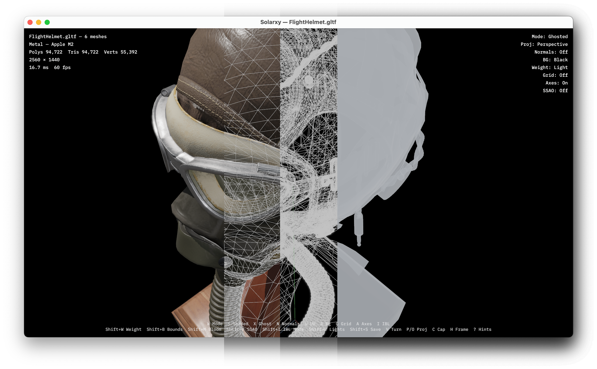

**Product Manager · Delivery Manager · Architect · Technologist**

I operate at the intersection of strategy, technology, and execution, taking products from zero to scale.

[koljam.com](https://koljam.com) &nbsp;·&nbsp; [LinkedIn](https://linkedin.com/in/marko-koljancic) &nbsp;·&nbsp; [X / Twitter](https://twitter.com/marko_koljancic) &nbsp;·&nbsp; [YouTube](https://youtube.com/c/MarkoKoljancic) &nbsp;·&nbsp; [Vimeo](https://vimeo.com/koljam)

## What I typically do

**Product Management and Strategy** - Full lifecycle ownership from discovery to roadmap to go-to-market.

**Program and Service Delivery** - Cross-functional orchestration bridging engineering and business.

**AEC Digital Transformation** - Deep domain expertise in BIM strategy, digital adoption, and workflow optimization.

**Technology Strategy** - Former startup Digital Technology Manager and CTO. Built custom development units and set technical foundations for scalable growth, including web-based computational platforms and BIM automation in AEC/O sector.

## What I'm currently exploring

What keeps me awake is fueling my passion in digital automation, computer graphics, and exploring and building products (sometimes outside the realm of digital).

- Passionate about OpenBIM and the impact of restraining from proprietary ecosystems
- Parametric modeling in BIM, product development, and computer graphics (still a believer in node-based UIs)
- Sharing knowledge and receiving knowledge

## What I'm lately focused on

**[Solarxy](https://github.com/marko-koljancic/solarxy)** - A passion project of mine. A lightweight, cross-platform, high-performance computer graphics 3D model viewer and validator built with Rust and wgpu. Inspect 3D models in a real-time graphical viewer or analyze them from the terminal with built-in validation checks.

Full story at <a href="https://koljam.com">koljam.com</a>
