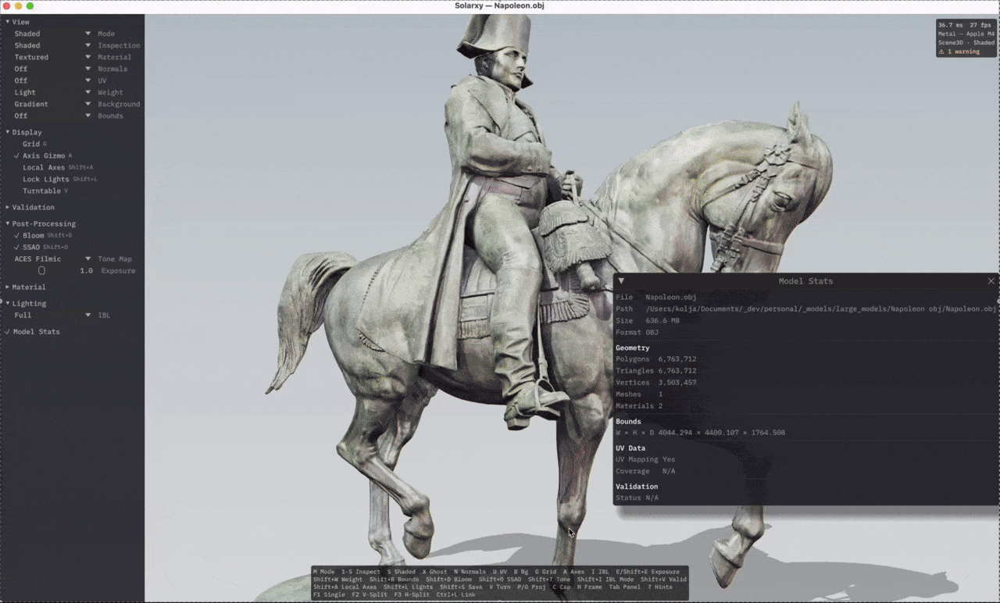

**Product Manager · Delivery Manager · Architect · Technologist**

I operate at the intersection of strategy, technology, and execution, taking products from zero to scale.

[koljam.com](https://koljam.com) &nbsp;·&nbsp; [LinkedIn](https://linkedin.com/in/marko-koljancic) &nbsp;·&nbsp; [X / Twitter](https://twitter.com/marko_koljancic) &nbsp;·&nbsp; [YouTube](https://youtube.com/c/MarkoKoljancic) &nbsp;·&nbsp; [Vimeo](https://vimeo.com/koljam)

## What I do

**Product Management and Strategy** — Full lifecycle ownership from discovery to roadmap to go-to-market. Scaled active user bases from 2,000 to 200,000+. PMI-PMP, PMI-PBA, PMI-ACP, ITIL, SAFe certified.

**Program and Service Delivery** — Cross-functional orchestration bridging engineering and business. P&L responsibility, SLAs, client management from startups to enterprises.

**AEC Digital Transformation** — Deep domain expertise in BIM strategy, digital adoption, and workflow optimization. Autodesk Certified Instructor and Professional across Revit, 3ds Max, and AutoCAD. Trained 800+ engineers in BIM and 3D visualization.

**Technology Strategy** — Former startup leader. Built custom development units and set technical foundations for scalable growth, including web-based computational platforms and Revit API automation. Crafted and led many products end to end from inception to 

## What I build after hours

**[Solarxy](https://github.com/marko-koljancic/solarxy)** — A cross-platform 3D model viewer and visual debugger built in Rust with wgpu. PBR rendering, split viewports, inspection overlays, terminal-based validation. Single binary, under a few MB, runs on macOS, Linux, and Windows. MIT licensed.

I find it valuable to switch places from time to time. Be on every side of the product development spectrum instead of just one. Define specs, shape roadmaps, and also write the code. Implement, test, deploy, break things, fix them, ship.

## Interests

- OpenBIM and the impact of moving away from proprietary ecosystems
- Parametric modeling in BIM, product development, and computer graphics
- Rust, wgpu, and the WebGPU ecosystem
- Node-based UIs (still a believer)

<a href="https://koljam.com">koljam.com</a>